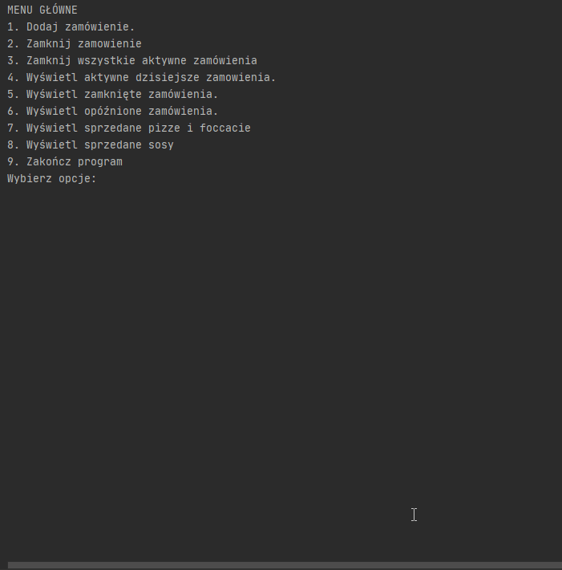

        
# Pizzeria-Pelnia
A scratch application which helps working with pizza orders. 
Application has special options for buisness client like : possibility to take orders half/half pizza, removing and adding ingredients etc.

## Table of contents
* [General info](#general-info)
* [Inspiration](#inspiration)
* [Screenshots](#screenshots)
* [Technologies](#technologies)
* [Setup](#setup)
* [Features](#features)
* [Status](#status)
* [Contact](#contact)

## General info
I create a small rpogram to help with the orders in pizzeria. 

## Inspiration
My inspiration was POS system (Point Of Sale System).
                                                                       

## Screenshots

<br>


## Technologies

Used Libraries: 

* java.io.*

## Setup

Installation would require the following components and configurations:

* Java version 11

After these are all set up, you can follow the next few instructions to get a copy of the application on your computer and test run the program:

1. Download the whole repo
2. Change the directory with the `cd` command into the *BrickBreaker* folder that is in the folder where the repo had been clone to
3. Run the program with 'App.java'

## Code Examples

```
private String generujWyswietlenieDlaPizzy(Rodzaj rodzajPierwszej) {
        StringBuilder wyswietlenie = new StringBuilder();
        wyswietlenie.append(wielkosc.getId());
        if (rodzajPierwszej.getTyp().getIdPizzy() < 10) {
            wyswietlenie.append(0);
        }
        wyswietlenie.append(rodzajPierwszej.getTyp().getIdPizzy());
        if (!czyPolNaPol()) {
            wyswietlenie.append("\n");
            wyswietlenie.append(rodzajPierwszej.generujWyswietlenieRodzajuDlaKuchni());
            return wyswietlenie.toString();
        } else {
            Rodzaj rodzajDrugiej = skladowa.get(1);

            wyswietlenie.append("/").append(rodzajDrugiej.getTyp().getIdPizzy()).append("\n");
            wyswietlenie.append(rodzajPierwszej.generujWyswietleniePolNaPolDlaKuchni(rodzajDrugiej));
        }
        return wyswietlenie.toString();
    }
```
```
public void skorygujPoprawnoscPizzy(List<Rodzaj> rodzaje) {

        if (rodzaje.size() != 2) {
            return;
        }
        Rodzaj rodzajPierwszej = rodzaje.get(0);
        Rodzaj rodzajDrugiej = rodzaje.get(1);
        boolean sosPierwszyBialy = rodzajPierwszej.getSosy().contains(Skladnik.SOS_BIALY_DO_PIZZY);
        boolean sosDrugiBialy = rodzajDrugiej.getSosy().contains(Skladnik.SOS_BIALY_DO_PIZZY);

        if (sosPierwszyBialy == sosDrugiBialy) {
            return;
        }
        Skladnik sos = ankieter.zapytajKtorySosZostawic();
        rodzajPierwszej.zamienSosy(sos);
        rodzajDrugiej.zamienSosy(sos);

    }
```
## Features

Features: 
* Add new functionalities
* Make a web application from this scratch


## Status
Project is still in progress  :)

## Contact
Created by [@malgorzatakowalska](https://www.malgorzatakowalska.com/) - feel free to contact me! 

